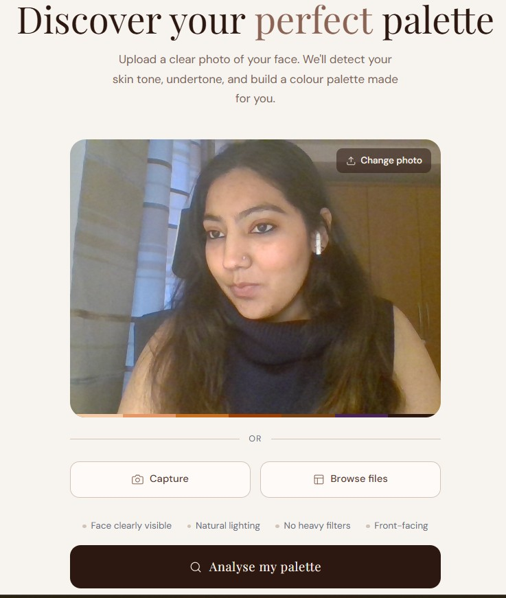
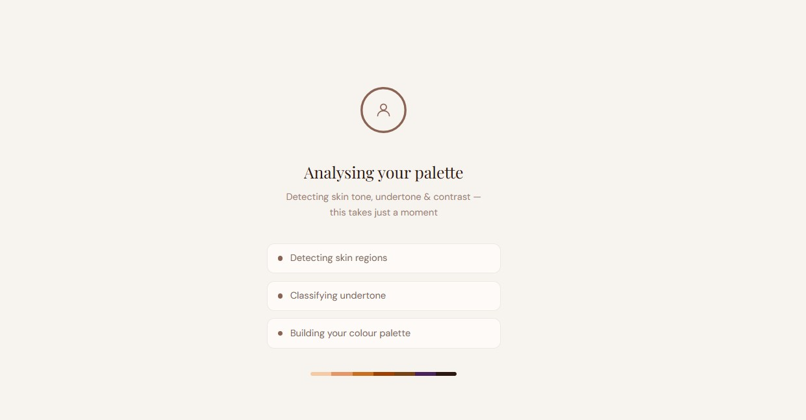
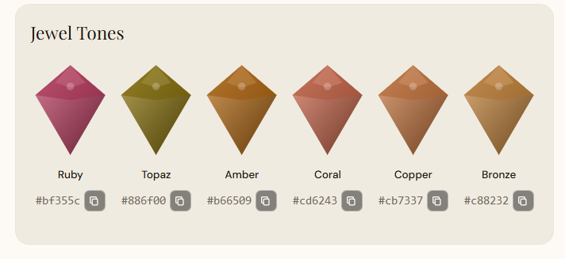
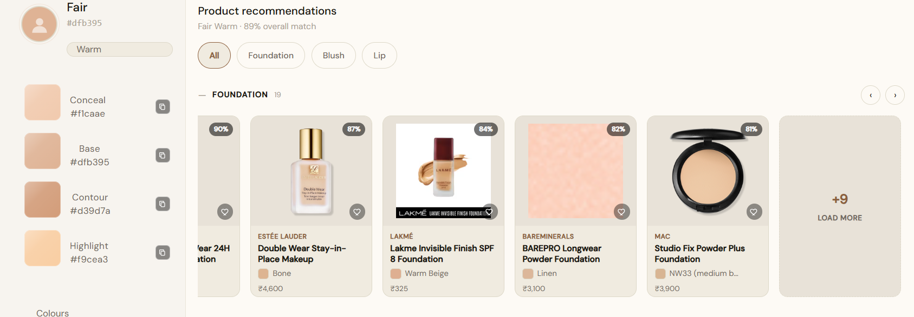
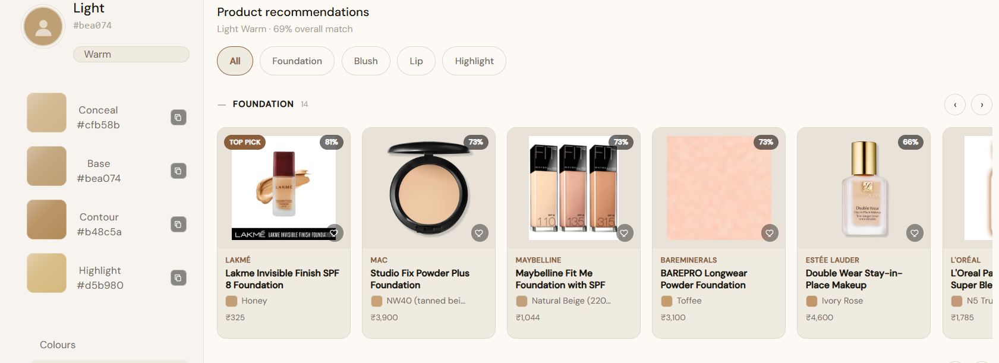
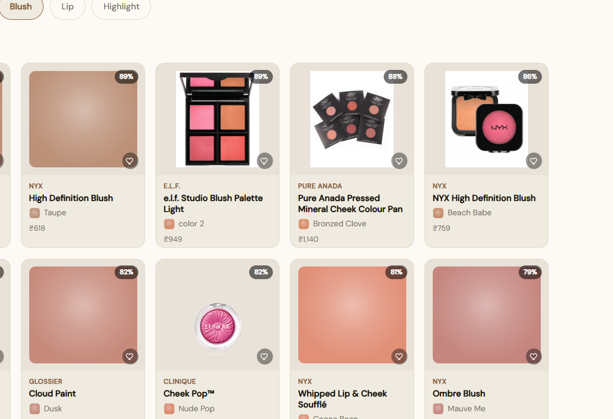
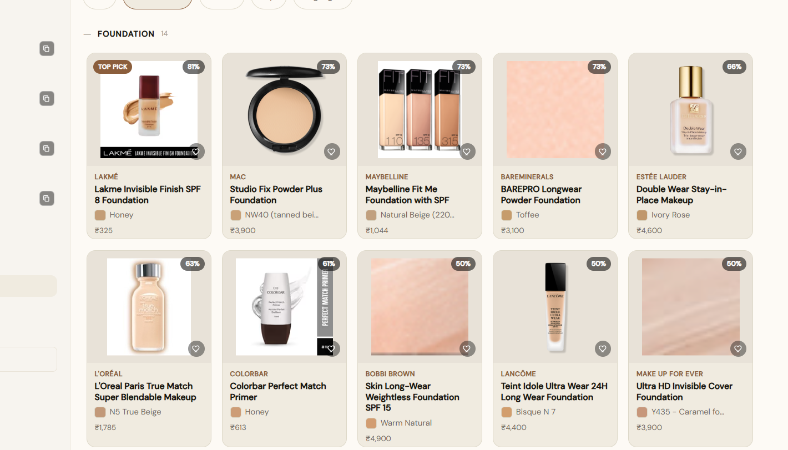
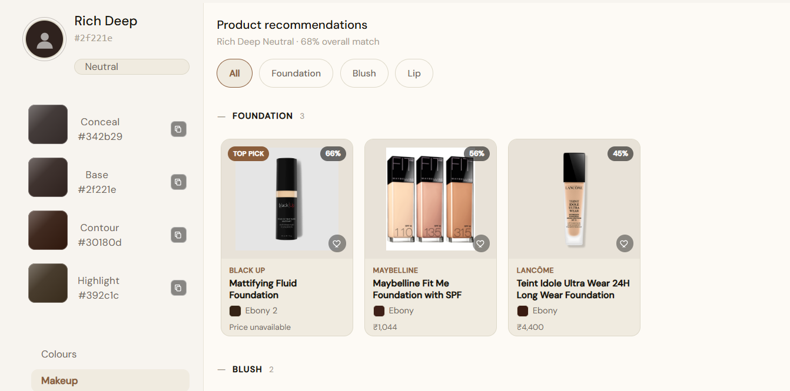
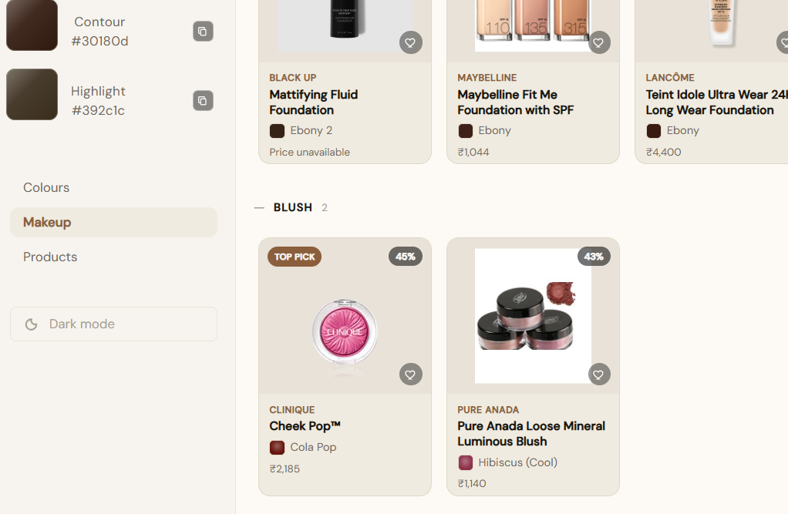
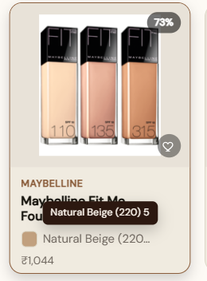

# Frontend — Skin Tone & Colour Analysis

A React + TypeScript web app for AI-powered skin tone analysis. Upload or capture a photo to receive your skin tone, undertone, and a full personalised colour palette.

> UI/UX design inspired by Pinterest's masonry layout and aesthetic.

---

## Tech Stack

- **React** + **TypeScript**
- **Redux Toolkit** — global state for image and analysis result
- **Vite** — build tooling
- **TailwindCSS** — utility-first styling
- **react-webcam** — in-browser camera capture

---

## Getting Started

**Clone the repo**
```bash
git clone https://github.com/aishwindersandhu/demoaApp
cd my-portfolio
git checkout SkinDetection-Panel
```

**Install dependencies**
```bash
npm install
```

**Run locally**
```bash
npm run dev
```


---

## Features

- Upload a photo or capture one via webcam
- Displays detected skin tone hex and depth label
- Displays undertone of the individual
- Colour palette tabs: warm, cool, dark, jewel tones
- Dual theme: Parchment (light) and Slate & Bone (dark)
- Playfair Display + DM Sans typography

---

## Current Limitations

- Mobile responsive layout is in progress — not fully polished yet
- Error handling is minimal — edge cases not fully covered
- The app is under active development
- The app generates hex color codes and not a proper naming convention.
---

## Current Implementation

>Upload Screen
Upload a photo or capture one directly via webcam. The image is previewed before analysis is triggered. 

- **Uploading an Image**

  

- **Screen Loading**
  


## Analysis Result - Sidebar
After analysis, the sidebar displays your detected skin tone hex, depth label, undertone classification, and your personalised makeup palette: Conceal, Base, Contour, and Highlight — each shade derived mathematically from your skin's LAB values.
| Slate & Bone (Dark theme) | Parchment (Light theme) |
|:---:|:---:|
|  |  |

The app ships with two themes switchable from the sidebar. Both use the same underlying CSS token system — only the token values change between themes.

## Array of user skin tones

| Deep Skin tone | Rich Deep Skin tone | Fair Skin tone |
|:---:|:---:|:---:|
|  |  |  |

| Medium Skin tone | Light Skin tone |
|:---:|:---:|
|  |  |

## Colour Palettes
Four palette categories are displayed in the Colours tab: Warm Colors, Cool Colors, Dark Colors, and Jewel Tones. Each palette contains 6 shades derived from the person's skin L value, with hues adjusted for their undertone.


The Jewel Tones palette, rendered as gem swatches.



- Warm Colors — earthy tones: camel, rust, burnt orange, mustard, warm olive
- Cool Colors — cool-leaning tones: navy, slate blue, emerald, plum, lavender
- Dark Colors — deep universal wearables: wine, burgundy, forest green, midnight blue, deep plum
- Jewel Tones — a set of rich, wearable jewel tones matched to that individual's skin tone, rendered as faceted gem-shaped swatches

## Color Swatch interaction

Hovering a swatch reveals the colour name and hex code with a copy button.


## Makeup products
Selecting **Makeup** in the sidebar swaps the palette view for personalised product recommendations: products are grouped into category shelves (Foundation, Blush, Lip, Highlight) and ranked by how closely each one's matched shade fits the detected undertone. Every listing is a real, currently-sold product — brand, shade, and price come from the actual catalogue (Estée Lauder, Lakmé, MAC, Maybelline, L'Oréal, BareMinerals, Bobbi Brown, Clinique and more), not placeholder data.

- **Foundation shelf — Fair Warm**

  The foundation shelf and its carousel behaviour.

  

- **Foundation shelf — Light Warm**

  

  The blush category for this skin tone.

  

  The expanded view of all foundations, which scrolls on load.

  

- **Foundation shelf — Rich Deep**

  The foundation shelf.

  

  Its respective blush shelf.

  

Each card shows a match-percentage badge (plus a **Top pick** badge on the best match in the category), the product image or a colour swatch rendered from the matched shade when no real photo exists, a save/heart toggle, brand, product name, matched shade, and price. Long brand or shade names truncate to fit the card and reveal the full text in a tooltip on hover.

- **Product card hover state**

  

Shelves scroll horizontally by default; filtering to a single category instead of "All" expands that shelf into a wrapped grid.

## Roadmap

- [ ] Mobile responsive layout
- [ ] Improved upload and webcam capture UI
- [ ] Proper error handling with fallback UI
- [ ] Additional colour palette categories
- [ ] More UI animations for smoother UX
- [ ] Unit tests for key components
- [ ] Performance optimisation
