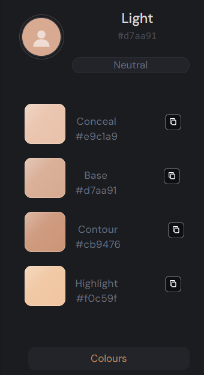
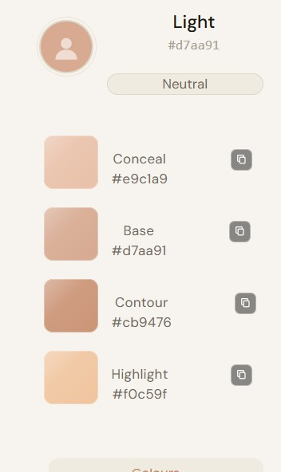
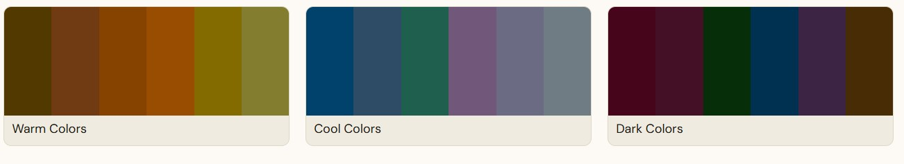
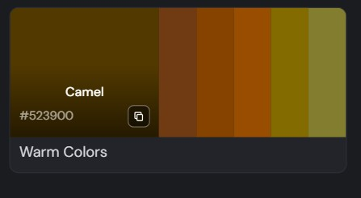

# Tonly — Frontend

A React + TypeScript web app for AI-powered skin tone analysis. Upload or capture a photo to receive your skin tone, undertone, and a full personalised colour palette.

> UI/UX design inspired by Pinterest's masonry layout and aesthetic.

---

## Tech Stack

- **React** + **TypeScript**
- **Redux Toolkit** — global state for image and analysis result
- **Vite** — build tooling
- **TailwindCSS** — utility-first styling
- **react-webcam** — in-browser camera capture

---

## Getting Started

**Clone the repo**
```bash
git clone https://github.com/aishwindersandhu/demoaApp
cd demoaApp
git checkout SkinDetection-Panel
```

**Install dependencies**
```bash
npm install
```

**Run locally**
```bash
npm run dev
```


---

## Features

- Upload a photo or capture one via webcam
- Displays detected skin tone hex and depth label
- Displays undertone of the individual
- Colour palette tabs: warm, cool, dark, jewel tones
- Dual theme: Parchment (light) and Slate & Bone (dark)
- Playfair Display + DM Sans typography

---

## Current Limitations

- Desktop-only layout — mobile responsive version is under development
- Error handling is minimal — edge cases not fully covered
- The app is under active development
- The app generates hex color codes and not a proper naming convention.
---

## Current Implementation

>Upload Screen
Upload a photo or capture one directly via webcam. The image is previewed before analysis is triggered. 

>Analysis Result - Sidebar
After analysis, the sidebar displays your detected skin tone hex, depth label, undertone classification, and your personalised makeup palette: Conceal, Base, Contour, and Highlight — each shade derived mathematically from your skin's LAB values.
- Slate/Bone (Dark Theme)
 
- Parchment (Light Theme)


The app ships with two themes switchable from the sidebar. Both use the same underlying CSS token system — only the token values change between themes.

>Colour Palettes
Three palette categories are displayed in the Colours tab: Warm Colors, Cool Colors, and Dark Colors. Each palette contains 6 shades derived from the person's skin L value, with hues adjusted for their undertone.



- Warm Colors — earthy tones: camel, rust, burnt orange, mustard, warm olive
- Cool Colors — cool-leaning tones: navy, slate blue, emerald, plum, lavender
- Dark Colors — deep universal wearables: wine, burgundy, forest green, midnight blue, deep plum

>Color Swatch interaction


Hovering a swatch reveals the colour name and hex code with a copy button.

## Roadmap

- [ ] Mobile responsive layout
- [ ] Improved upload and webcam capture UI
- [ ] Proper error handling with fallback UI
- [ ] Additional colour palette categories
- [ ] More UI animations for smoother UX
- [ ] Unit tests for key components
- [ ] Performance optimisation